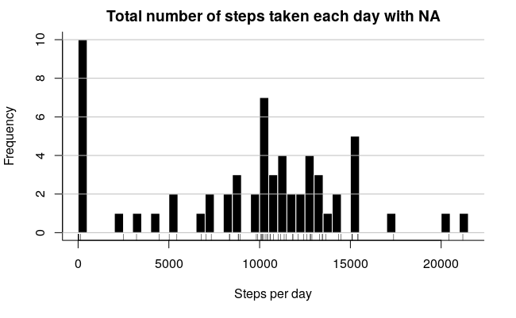

title |	author | date |	output
------|--------|------|-------
Reproducible Research: Peer Assessment 1 | Aleksander Petrovskii | March 21, 2017 | html_document |


# Reproducible Research: Peer Assessment 1

## 1. Loading and preprocessing the data

```r
knitr::opts_chunk$set(echo = TRUE)  
rm(list=ls())  
library(tidyr)  
library(dplyr)  
library(stringr)  
library(ggplot2)  
project.dir <- "/home/petr0vsk/Project3"  
stopifnot( dir.exists(file.path(project.dir))  )  
setwd(file.path(project.dir))  
steps.raw <- read.csv("activity.csv",  header = TRUE)   
str(steps.raw)  
```

## 2. What is mean total number of steps taken per day?

1. Make a histogram of the total number of steps taken each day Calculate total number of steps taken each day
```r
sum.steps.per.day.withNA <- steps.raw %>%
    group_by(date) %>%
    summarise_each(funs( sum(steps, na.rm = T) ), steps = steps) %>%
as.data.frame()
```
Histogram of the total number of steps taken each day

 

Calculate and report the mean and median total number of steps taken per day
```r
mn.NA <- round(mean(sum.steps.per.day.withNA$steps, na.rm = T),2)
md.NA <- median(sum.steps.per.day.withNA$steps, na.rm = TRUE)
print(paste0("mean.with.NA = ", mn.NA))
print(paste0("median.with.NA = ", md.NA))
```

