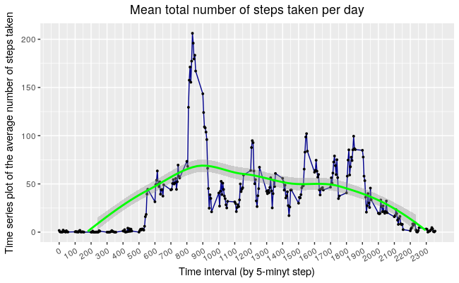

title |	author | date |	output
------|--------|------|-------
Reproducible Research: Peer Assessment 1 | Aleksander Petrovskii | March 21, 2017 | html_document |


# Reproducible Research: Peer Assessment 1

## 1. Loading and preprocessing the data

```r
knitr::opts_chunk$set(echo = TRUE)  
rm(list=ls())  
library(tidyr)  
library(dplyr)  
library(stringr)  
library(ggplot2)  
project.dir <- "/home/petr0vsk/Project3"  
stopifnot( dir.exists(file.path(project.dir))  )  
setwd(file.path(project.dir))  
steps.raw <- read.csv("activity.csv",  header = TRUE)   
str(steps.raw)  
```
> 'data.frame':	17568 obs. of  3 variables:  
>  $ steps   : int  NA NA NA NA NA NA NA NA NA NA ...  
>  $ date    : Factor w/ 61 levels "2012-10-01","2012-10-02",..: 1 1 1 1 1 1 1 1 1 1 ...  
>  $ interval: int  0 5 10 15 20 25 30 35 40 45 ...  


## 2. What is mean total number of steps taken per day?

1. Make a histogram of the total number of steps taken each day Calculate total number of steps taken each day
```r
sum.steps.per.day.withNA <- steps.raw %>%
    group_by(date) %>%
    summarise_each(funs( sum(steps, na.rm = T) ), steps = steps) %>%
as.data.frame()
```
Histogram of the total number of steps taken each day

 

Calculate and report the mean and median total number of steps taken per day
```r
mn.NA <- round(mean(sum.steps.per.day.withNA$steps, na.rm = T),2)
md.NA <- median(sum.steps.per.day.withNA$steps, na.rm = TRUE)
print(paste0("mean.with.NA = ", mn.NA))
print(paste0("median.with.NA = ", md.NA))
```
> [1] "mean.with.NA = 9354.23"  
> [1] "median.with.NA = 10395"  

## 3. What is the average daily activity pattern?
```r
daily.activity.average.with.NA <- steps.raw %>%
    group_by(interval) %>%
summarise_each(funs(mean(steps, na.rm = TRUE)), steps = steps) 
```
Make a time series plot (i.e. type = "l") of the 5-minute interval (x-axis) 
and the average number of steps taken, averaged across all days (y-axis)
```r
brake.vec <- as.vector(seq(1,288,by=12))  
ggplot(daily.activity.average.with.NA, aes(x=interval, y=steps)) +  
    geom_line(colour = "darkblue") +                                                                                      geom_point(size=0.7) +    
    scale_x_continuous(name = "Time interval (by 5-minyt step)", limits = c(0,tail(daily.activity.average.with.NA$interval,   n=1)), breaks = daily.activity.average.with.NA$interval[brake.vec])  +  
    scale_y_continuous(name = "Time series plot of the average number of steps taken", limits =   c(0,max(daily.activity.average.with.NA$steps))) +  
    ggtitle("Mean total number of steps taken per day") +  
    theme(plot.title = element_text(hjust = 0.5)) +  
    theme(axis.text.x = element_text(angle=30, hjust=1, vjust=1)) +  
stat_smooth(colour="green", method = 'loess', na.rm=TRUE)   
```
   


