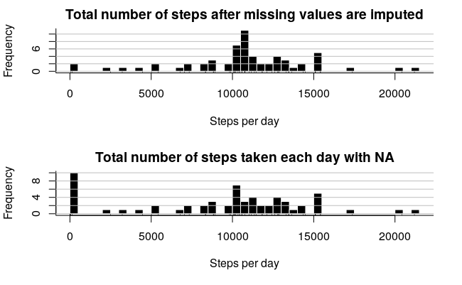
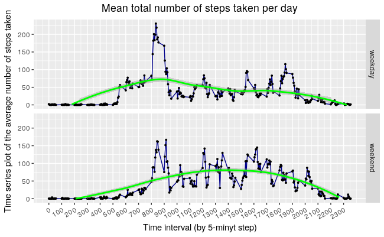

title |	author | date |	output
------|--------|------|-------
Reproducible Research: Peer Assessment 1 | Aleksander Petrovskii | March 21, 2017 | html_document |


# Reproducible Research: Peer Assessment 1

## 1. Loading and preprocessing the data

```r
knitr::opts_chunk$set(echo = TRUE)  
rm(list=ls())  
library(tidyr)  
library(dplyr)  
library(stringr)  
library(ggplot2)  
project.dir <- "/home/petr0vsk/Project3"  
stopifnot( dir.exists(file.path(project.dir))  )  
setwd(file.path(project.dir))  
steps.raw <- read.csv("activity.csv",  header = TRUE)   
str(steps.raw)  
```
> 'data.frame':	17568 obs. of  3 variables:  
>  $ steps   : int  NA NA NA NA NA NA NA NA NA NA ...  
>  $ date    : Factor w/ 61 levels "2012-10-01","2012-10-02",..: 1 1 1 1 1 1 1 1 1 1 ...  
>  $ interval: int  0 5 10 15 20 25 30 35 40 45 ...  


## 2. What is mean total number of steps taken per day?

1. Make a histogram of the total number of steps taken each day Calculate total number of steps taken each day
```r
sum.steps.per.day.withNA <- steps.raw %>%
    group_by(date) %>%
    summarise_each(funs( sum(steps, na.rm = T) ), steps = steps) %>%
as.data.frame()
```
Histogram of the total number of steps taken each day

 

Calculate and report the mean and median total number of steps taken per day
```r
mn.NA <- round(mean(sum.steps.per.day.withNA$steps, na.rm = T),2)
md.NA <- median(sum.steps.per.day.withNA$steps, na.rm = TRUE)
print(paste0("mean.with.NA = ", mn.NA))
print(paste0("median.with.NA = ", md.NA))
```
> [1] "mean.with.NA = 9354.23"  
> [1] "median.with.NA = 10395"  

## 3. What is the average daily activity pattern?
```r
daily.activity.average.with.NA <- steps.raw %>%
    group_by(interval) %>%
summarise_each(funs(mean(steps, na.rm = TRUE)), steps = steps) 
```
Make a time series plot (i.e. type = "l") of the 5-minute interval (x-axis) 
and the average number of steps taken, averaged across all days (y-axis)
```r
brake.vec <- as.vector(seq(1,288,by=12))  
ggplot(daily.activity.average.with.NA, aes(x=interval, y=steps)) +  
    geom_line(colour = "darkblue") +
    geom_point(size=0.7) +    
    scale_x_continuous(name = "Time interval (by 5-minyt step)", limits = c(0,tail(daily.activity.average.with.NA$interval,   n=1)), breaks = daily.activity.average.with.NA$interval[brake.vec])  +  
    scale_y_continuous(name = "Time series plot of the average number of steps taken", limits =   c(0,max(daily.activity.average.with.NA$steps))) +  
    ggtitle("Mean total number of steps taken per day") +  
    theme(plot.title = element_text(hjust = 0.5)) +  
    theme(axis.text.x = element_text(angle=30, hjust=1, vjust=1)) +  
stat_smooth(colour="green", method = 'loess', na.rm=TRUE)   
```
   

Which 5-minute interval, on average across all the days in the dataset, contains the maximum number of steps?
```r
max.steps <- daily.activity.average.with.NA[which.max(daily.activity.average.with.NA$steps),]
print(paste0("5-minute interval, contains the maximum number of steps is ", max.steps))
```
> [1] "5-minute interval, contains the maximum number of steps is 835"             
> [2] "5-minute interval, contains the maximum number of steps is 206.169811320755"

## 4. Imputing missing values  
All of the missing values are replased with mean value for that 5-minute interval  
Calculate and report the total number of missing values in the dataset  
```r
print(paste0("Total number of missing values in the datase = ", sum(is.na(steps.raw$steps)) ))
```
> [1] "Total number of missing values in the datase = 2304"

Create a new dataset that is equal to the original dataset but with the missing data filled in
replase NA with median of interval   
```r
steps.raw.clear <- steps.raw
for(i in 1:length(steps.raw.clear$steps))   {
    if( is.na(steps.raw.clear$steps[i]) )        {
        steps.raw.clear$steps[i]<- filter(daily.activity.average.with.NA, interval==steps.raw.clear$interval[i])%>%
                  select(steps) %>%
                  round(2)
    }#if..
}#for..
steps.raw.clear$steps <- unlist(steps.raw.clear$steps)
```
## 5. Are there differences in activity patterns between weekdays and weekends?   
What is sum of total number of steps taken per day?   
```r
sum.steps.per.day.withoutNA <- steps.raw.clear %>%
    group_by(date) %>%
    summarise_each(funs( sum(steps) ), steps = steps) 
mn <- round(mean(sum.steps.per.day.withoutNA$steps),2)
md <- median(sum.steps.per.day.withoutNA$steps)
```
Histogram of the total number of steps taken each day without NA and (for comparison) with NA
```r
par(mfrow= c(2,1))
hist(sum.steps.per.day.withoutNA$steps, main = "Total number of steps after missing values are imputed", 
     breaks = 61,
     xlab = "Steps per day", ylab = "Frequency",
     col="black",
     border="white")
box(bty="l")
grid(nx=NA,ny=NULL,lty=1,lwd=1,col="gray")
rug(sum.steps.per.day.withoutNA$steps)

hist(sum.steps.per.day.withNA$steps, main = "Total number of steps taken each day with NA", 
     breaks = 61,
     xlab = "Steps per day", ylab = "Frequency",
     col="black",
     border="white")
box(bty="l")
grid(nx=NA,ny=NULL,lty=1,lwd=1,col="gray")
rug(sum.steps.per.day.withNA$steps)
```
 

Print mean and median
```{r echo=TRUE}
print(paste0("mean.with.NA = ", mn.NA))
print(paste0("median.with.NA = ", md.NA))
print(paste0("after missing values are imputed mean = ", mn))
print(paste0("after missing values are imputed median = ", md))

```
> [1] "mean.with.NA = 9354.23"   
> [1] "median.with.NA = 10395"   
> [1] "after missing values are imputed mean = 10766.18"   
> [1] "after missing values are imputed median = 10766.13"  

Find the day of the week for each measurement in the dataset
```r
steps.raw.clear$date <- as.Date(steps.raw.clear$date)
for(i in 1:length(steps.raw.clear$steps))   {
      if( weekdays(steps.raw.clear$date[i]) %in% c("Saturday", "Sunday")  )   {
        steps.raw.clear$weekday[i] <-  "weekend"     
                    }#if..
        else {
            steps.raw.clear$weekday[i] <-  "weekday"
        } 
}#for..
```
Panel plot comparing the average number of steps taken per 5-minute interval   
across weekdays and weekends  

```{r echo=TRUE}
mean.steps.raw.clear <- steps.raw.clear %>%
    group_by(interval,weekday) %>%
    summarise_each(funs( mean(steps)), steps = steps, weekday = weekday) 
ggplot(mean.steps.raw.clear, aes(x=interval, y=steps)) +
    geom_line(colour = "darkblue") +  
    facet_grid(weekday ~ .) + 
    geom_point(size=0.7) +
    scale_x_continuous(name = "Time interval (by 5-minyt step)", limits = c(0,tail(mean.steps.raw.clear$interval, n=1)), breaks = daily.activity.average.with.NA$interval[brake.vec])  +
    scale_y_continuous(name = "Time series plot of the average number of steps taken", limits = c(0,max(mean.steps.raw.clear$steps))) +
    ggtitle("Mean total number of steps taken per day") +
    theme(plot.title = element_text(hjust = 0.5)) +
    theme(axis.text.x = element_text(angle=30, hjust=1, vjust=1)) +
stat_smooth(colour="green", method = 'loess', na.rm=TRUE) 
```
 


